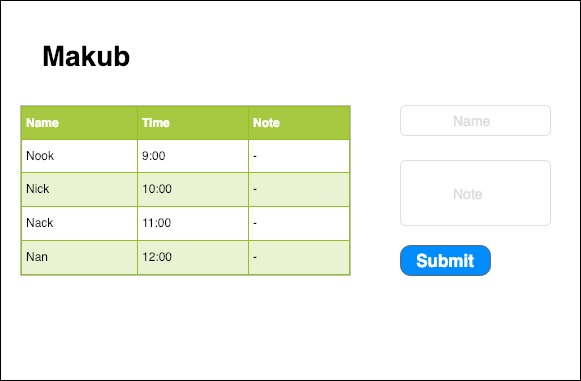

# Welcome to Makub Version 1.0.0
### This toturial created for learn basic Electron, Makub is time attend system

## เมนู

1) [ติดตั้งElectron](./docs/1_install.md)
2) [เริ่มด้วยMainProcess](./docs/2_start_main_process.md)
3) [สร้างUserInterface](./docs/3_render_process.md)
4) [Programming](./docs/4_programming.md)
5) [BuildWindowApp](./docs/5_BuildWinApp.md)

## User Interface

## ref

- [electron-quick-start](https://electronjs.org/docs/tutorial/quick-start)
- [tutorialspoint](https://www.tutorialspoint.com/electron/)