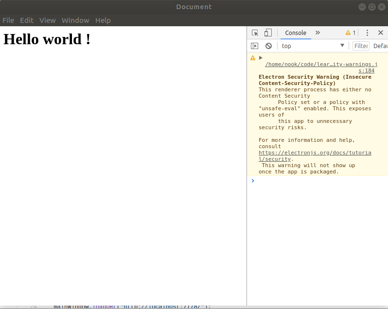

### เริ่มต้นใช้งาน Electron

โครงสร้างของ Electron แบ่งเป็น 

* Main Process
* Renderer Processes


Main Process คือ Core หลักของ Electron ในการจัดการทุกอย่างใน Application เช่น การสร้างกรอบ Brower window เปล่า ๆ ขึ้นมา โดยมี Render Process เพื่อแสดงผล HTML CSS 
ดังนั้น ถ้าเกิดมีหน้าแสดงผลไหนถูกปิด Render Process ของหน้านั้นก็จะถูกกำจัดไปด้วย แต่ Main Process จะยังอยู่


1) ทำการสร้างไฟล์ main.js เพื่อเขียน code Main Process, code:

```javascript
const {
    app,
    BrowserWindow
} = require('electron')
const url = require('url')
const path = require('path')

```
code โค้ดข้างบน คือการเรียกใช้ electron object ในบื้องต้นใช้แค่ app, กับ BrowerWindow  ส่วน url กับ path คือ api ของ nodejs ที่ช่วยในการจัดการเส้นทางไฟล์ใน poject

2) สร้างไฟล์ index.html สำหรับ render process เป็นหน้าแรกที่ต้องการแสดงผล 

```html
<html lang="en">
    <head>    
        <title>Document</title>
    </head>
    <body>
        <h1>Hello world !</h1>    
    </body>
</html>
```
3) กลับมาที่ ไฟล์ main.js เพิ่ม function createWindow สำหรับสร้าง render procress 

```javaScript
    function createWindow() {
    let win = new BrowserWindow({
        width: 800,
        height: 600
    })

    win.loadURL(url.format({
        pathname: path.join(__dirname, 'index.html'),
        protocol: 'file:',
        slashes: true
    }))

    // Open chrome dev tool
    win.webContents.openDevTools()
}
```
ทำการสร้าง windows แรกขึ้นมา ด้วยขนาด 800 x 600 จากนั้นทำการโหลดไฟล์ index.html มาแสดงใน windows ที่ถูกสร้างขึ้น
่ส่วน win.webContents.openDevTools() คือการเปิด chrome dev tool เพื่อให้การ debug สะดวกขึ้น

4) ทำการเรียกใช้ createWindow function เมื่อ electron app พร้อมทำงาน
ด้วยการเพิ่ม code:
```javascript
    app.on('ready', createWindow)
```
app.on คือ events ของ electron ซึ่งใน basic นี้ จะใช้แค่ 1 event คือเมื่อ app พร้อม (ready event) ให้ callback function createWindow สร้าง render procress แรกขึ้นมา

5)  ทำการ start app ด้วยคำสั่ง 
```bash
npm run dev
```
จะแสดงหน้าต่างแรกขึ้นมา
