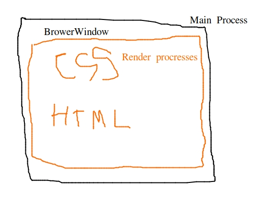

### เริ่มต้นใช้งาน Electron

โครงสร้างของ Electronjs แบ่งเป็น 

* Main Process
* Renderer Processes



Main Process คือ Core หลักของ Electron ในการจัดการทุกอย่างใน Application เช่น การสร้างกรอบ Brower window เปล่า ๆ ขึ้นมา โดยมี Render Process เพื่อแสดงผล HTML CSS 
ดังนั้น ถ้าเกิดมีหน้าแสดงผลไหนถูกปิด Render Process ของหน้านั้นก็จะถูกกำจัดไปด้วย แต่ Main Process จะยังอยู่


ทำการสร้างไฟล์ main.js เพื่อเขียน code Main Process :

```javascript
const {
    app,
    BrowserWindow
} = require('electron')
const url = require('url')
const path = require('path')

```
code โค้ดข้างบน คือการเรียกใช้ electron object ในบื้องต้นใช้แค่ app, กับ BrowerWindow url ส่วน path คือ api ของ nodejs ที่ช่วยในการจัดการเส้นทางไฟล์ใน rojects

